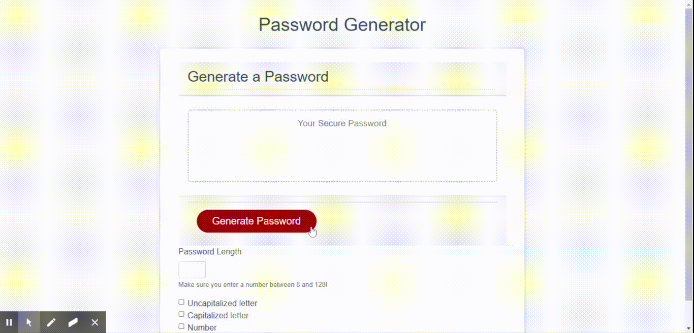

## Table of contents

- [General info](#general-info)
- [Functionality](#functionality)
- [Technologies](#technologies)
- [Github Link](#github-link)

## General Info

This application is a simple random password generator. The user will check which type of character set they want in their password and they must also specify the desired length. The length of the password needs to be between 8 and 128, otherwise an error will be displayed. At least one checkbox must be selected, otherwise an error will be displayed.

## Functionality

## Technologies

Built with Vanilla JS & Bootstrap
